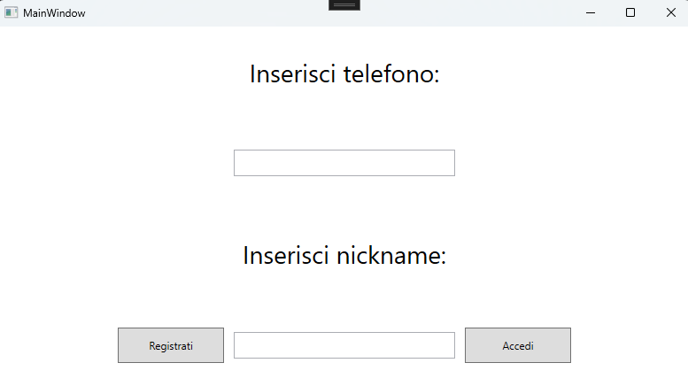
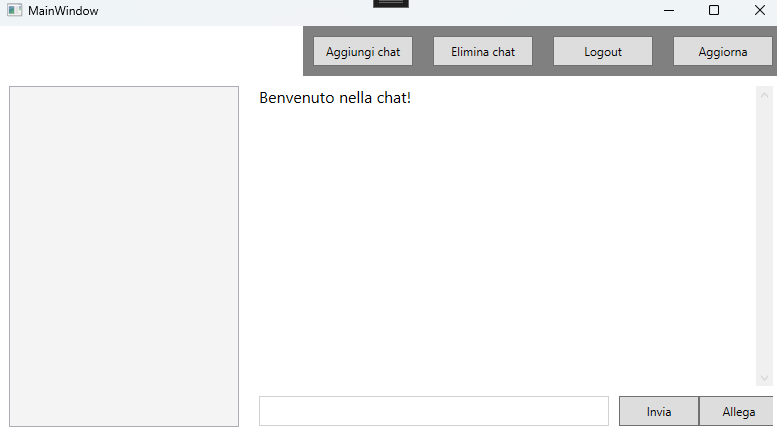
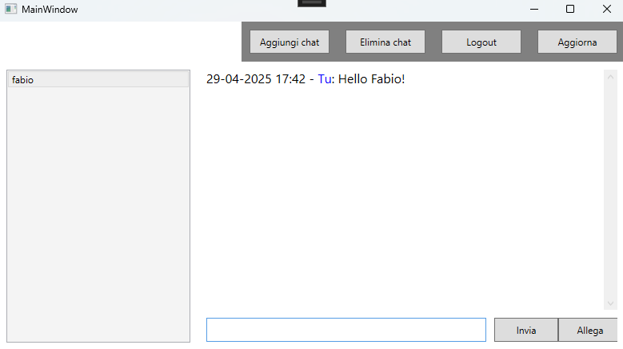
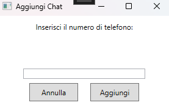
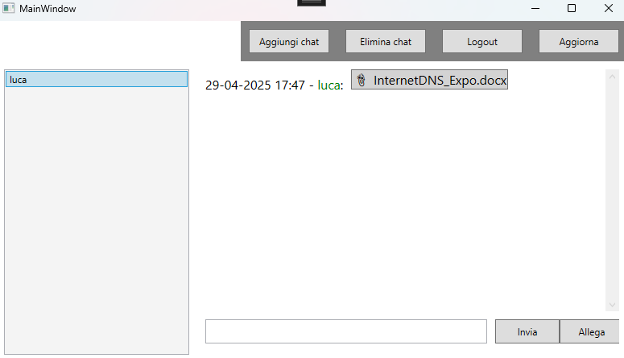

# BignoMessaggistica_live

**BignoMessaggistica_live** è un'applicazione desktop sviluppata in **C# con WPF** per la gestione di messaggi e conversazioni. Il progetto è strutturato per fornire un'interfaccia grafica intuitiva per utenti che desiderano inviare, ricevere e organizzare comunicazioni oltre a consentire lo scambio di file e immagini.

## 🚀 Funzionalità principali

- 🔐 Schermata di accesso personalizzata (`Accesso.xaml`)
- 💬 Aggiunta e gestione di chat e messaggi (`AddChatDialog.xaml`)
- 📊 Interfaccia principale dashboard per navigazione e controllo (`Dashboard.xaml`)
- ⚙️ Architettura modulare in XAML e code-behind C#

## 🛠 Requisiti

- Windows 10/11
- [.NET Framework 4.7.2+](https://dotnet.microsoft.com/en-us/download/dotnet-framework)
- [Visual Studio 2019+](https://visualstudio.microsoft.com/) con supporto WPF

## ▶️ Come eseguire il progetto

1. Clona o scarica il repository.
2. Apri il file della soluzione.  
3. Compila ed esegui il progetto tramite Visual Studio.

## 📁 Struttura del progetto

- `Accesso.xaml`: Schermata iniziale per l'autenticazione.
- `Dashboard.xaml`: Interfaccia principale dopo il login.
- `AddChatDialog.xaml`: Finestra per creare nuove chat.
- `MainWindow.xaml`: Finestra principale dell'applicazione.
- `App.xaml`: Entry point dell'app WPF.

## 📸 Screenshot

### 🔐 Schermata di Accesso

### 📊 Dashboard principale

### 💬 Esempio di messaggio

### ➕ Finestra di aggiunta nuova chat

### 📎 Invio di un file allegato

